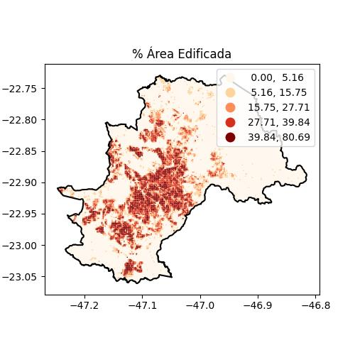
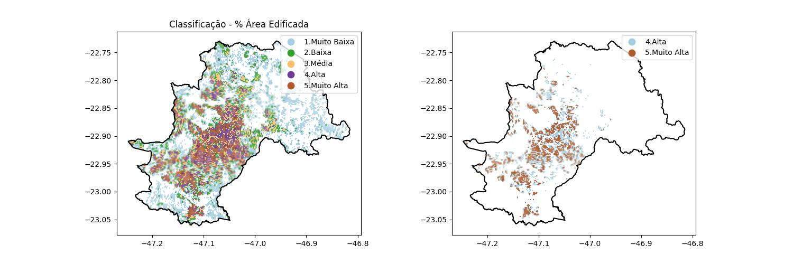
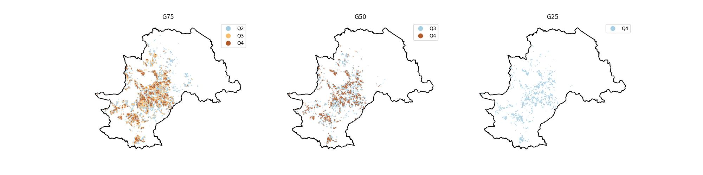

# Levantamento do % de Área Edificada em Campinas com Google OpenBuildings

Este projeto é um pequeno estudo cujo objetivo é mostrar (ainda que superficialmente) as possibilidades e a importância da a área edificada (aqui considerada apenas como a área coberta pelas edificações do Google OpenBuildings) para estudos e análises intraurbanas de uma grande cidade como Campinas/SP.

## Google OpenBuildings

O [Google OpenBuildings](https://sites.research.google/open-buildings/) é um dataset com os *building footprints* de quase todo o mundo gerados automaticamente pelo Google e disponibilizados para download. São polígonos que ajudam a entender com precisão a presença humana no território e são, por isso, insumos fundamentais para estudos intraurbanos, ambientais, levantamentos estatísticos etc.

## Metodologia
* Refs:
    * CRS de Referência para plotagem dos dados: [4674 - SIRGAS 2004](https://epsg.io/4674)
    * CRS de Referência para cálculo de área: [31983 - SIRGAS 2000 / UTM zone 23S](https://epsg.io/31983)

* Geração do Grid com 200m de lado e cálculo da área em *m²*;
* Sobreposição (*Intersect*) das Edificações com o Grid;
* Cáculo da área das edificações intersectadas com cada Grid - **Área Edificada**;
* Cálculo dos percentuais da área edificada em cada Grid;

    
* Classificação dos percentuais de Área Edificada com base na própria densidade;

    
* Classificação da [concentração](https://www.embrapa.br/macrologistica/como-fizemos/analise-da-producao) da Área Edificada em Quarteis.

    

#### Observações
Não é um projeto de trabalho acadêmico. É apenas um breve levantamento utilizando dados do Google OpenBuildings em um contexto intraurbano.